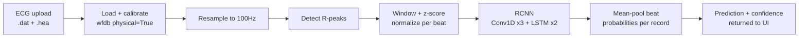

# ECG Intelligence

AI-powered ECG classification on the [PTB-XL](https://physionet.org/content/ptb-xl/1.0.3/) clinical dataset, using an RCNN (1D CNN + LSTM) deep-learning model, served through a FastAPI REST API with interactive OpenAPI docs at `/docs`.

> **Not a medical device.** This is a research and portfolio engineering project. It has not been clinically validated and must never be used for real diagnosis or treatment decisions. See [Ethical & medical disclaimer](#ethical--medical-disclaimer).

## Live demo

Frontend: **https://ecg-detection-two.vercel.app** (static UI, deployed on Vercel). The FastAPI backend (Render) is deployed separately - see [Deployment](#deployment) for its current status before assuming the live upload flow works end to end. Run the whole thing locally in under 5 minutes: see [Setup](#setup) and [Running the app](#application) below, or the [screenshot](#screenshots) for a preview of the flow.

## Screenshots


*Real output from a live local run: uploading the bundled sample WFDB record through the actual UI, end to end - not a mockup.*

## Overview

Given an uploaded ECG waveform (WFDB `.dat`, optionally with its `.hea` header), the system:

1. loads and calibrates the signal,
2. detects individual heartbeats (R-peaks),
3. extracts a fixed-duration window around each beat,
4. classifies each beat as **normal** or **abnormal** with an RCNN trained on PTB-XL,
5. returns an aggregate prediction, confidence, beat count and the raw waveform for display.

The same preprocessing code path is used for training, evaluation and live inference - there is exactly one implementation of R-peak detection and windowing in the whole codebase (`ecg/preprocessing.py`).



## Project structure

```
ecg/                    shared package - the single source of truth
  config.py             all paths, hyperparameters, env-var overrides
  preprocessing.py      WFDB loading, calibration, resampling, R-peak detection, windowing
  dataset.py            PTB-XL metadata, label rule, fold-based split, class balancing
  model.py              CNN / RCNN architectures, seeding
  postprocessing.py     record-level aggregation methods + probability calibration
  explainability.py     gradient saliency (model attribution)
  multilabel.py         experimental: PTB-XL diagnostic-superclass label mapping

scripts/
  prepare_data.py                          builds train/val/test segment arrays from PTB-XL (run once)
  train_model.py                           trains the CNN baseline + the primary RCNN
  select_aggregation_and_calibration.py    chooses aggregation + calibration on validation only
  evaluate_model.py                        scores both models on the untouched held-out test fold
  demo_predict.py                          CLI: run the trained model on one WFDB record
  prepare_multilabel_data.py               experimental multi-label data prep (proof-of-concept)
  train_multilabel_model.py                experimental multi-label training (proof-of-concept)

app/                    FastAPI backend - the inference REST API (no HTML; the UI is public/, below)
  main.py               app instance, CORS, exception handlers, lifespan (model load)
  model_state.py        loaded-model state + the non-sensitive model-info summary dict
  uploads.py            filename sanitization + size-capped upload reading (HTTP-layer only)
  routes/               health.py (/health), model_info.py (/model-info), predict.py (/predict)
  schemas/prediction.py Pydantic response models (ModelInfo, PredictionResponse, ...)

public/                 static frontend (deployed on Vercel) - plain HTML/CSS/JS, Chart.js for the waveform
api/config.js           one dependency-free Vercel Node function: hands the frontend ECG_API_URL

tests/                  pytest suite - config, preprocessing, dataset split/leakage, API/security
artifacts/              generated, gitignored: trained models, split arrays, reports/plots
data/demo/              one tiny bundled sample WFDB record used by tests and the CLI demo
docs/                   README screenshot(s)
.github/workflows/      CI: lint + unit tests on every push
Dockerfile              production deployment (Render/any container host)
MODEL_CARD.md           full model card: architecture, methodology, metrics, limitations
```

**Adaptations from a generic template layout:** models are written to `artifacts/models/` (generated, gitignored) rather than a committed top-level `models/` folder, since multi-megabyte binary weights don't belong in a public Git history without LFS. Configuration lives in `ecg/config.py` + `.env` rather than a separate `configs/` directory - the project has one runtime configuration surface, not multiple environments, so a config directory would be unused ceremony.

## Dataset

The full PTB-XL dataset (waveforms + metadata, several GB) is **not** stored in this repository. Point `ECG_DATASET_ROOT` at a local extraction of the PhysioNet release - the folder that directly contains `ptbxl_database.csv`, `records100/` and `records500/`:

```bash
cp .env.example .env
# edit ECG_DATASET_ROOT in .env to point at your local PTB-XL folder
```

If unset, it defaults to `~/Desktop/ECG-Files/dataset/ptb-xl-a-large-publicly-available-electrocardiography-dataset-1.0.3`. No dataset path is hardcoded into any source file that isn't this documented default.

### Dataset methodology

- **Split**: PTB-XL's official `strat_fold` column (1-10) is used instead of a random row split. It is stratified at the *patient* level - verified in `tests/test_dataset.py` and at prepare-time that zero patients span more than one fold - so folds 1-8/9/10 as train/val/test guarantees no patient's ECGs leak across the split. This is the split protocol recommended in the PTB-XL paper (Wagner et al., 2020), not an arbitrary choice.
- **Label**: a record is "normal" (0) if `NORM` is the only SCP-ECG statement present at *nonzero diagnostic likelihood*; everything else is "abnormal" (1). `scp_codes` values are confidence percentages (0-100), not booleans: `{'NORM': 100.0, 'SR': 0.0}` means NORM at 100% and SR explicitly *ruled out* at 0%, i.e. normal. An earlier, naive implementation (matching the original, pre-rewrite project) compared the raw key set instead of filtering by likelihood, which misclassified 8,786 of 21,799 records (40%) as abnormal solely because of a co-listed 0%-likelihood code. The corrected rule changes the label distribution from 190 normal / 21,609 abnormal to a realistic **8,976 normal / 12,823 abnormal**.
- **Balancing**: only the training fold is class-balanced (all normals + up to `ECG_TRAIN_ABNORMAL_RATIO`x as many randomly sampled abnormals); with the corrected label rule this is close to a no-op since the classes are already close to 1:1.4. A stratified cap (`ECG_TRAIN_MAX_RECORDS`, default 4000) is then applied to the training fold only, purely to keep a from-scratch CPU training run tractable - the full corrected training fold is ~17k records, which takes hours per epoch on CPU with the LSTM layers. **Validation and test are never balanced or capped** - they always keep the natural, imbalanced ratio so reported metrics reflect real-world performance rather than an artificially easy sample.
- **Leakage checks**: `scripts/prepare_data.py` explicitly asserts zero record-id and zero patient-id overlap across the three splits after the split is built, and writes the result to `artifacts/reports/data_preparation_report.json`. `tests/test_dataset.py` re-verifies the same invariant on synthetic data as a regression guard.

## Preprocessing pipeline

`ecg/preprocessing.py` is the only place ECG signal processing happens, used identically by data preparation, training and the live `/predict` endpoint:

1. **Load** - `wfdb.rdrecord(..., physical=True)` when a `.hea` header is present, giving a calibrated signal in millivolts (the original project used `physical=False`, raw ADC counts that aren't comparable across records with different amplifier gain). Falls back to a best-effort raw 12-channel int16 read when no header is available, with a logged warning that calibration could not be applied.
2. **Resample** to a fixed target rate (100Hz) regardless of the record's native sampling rate, so a fixed-length window always spans the same physical duration - without this, a 500Hz upload's window would cover 0.4s while a 100Hz training window covers 2s of the same nominal window size.
3. **Detect R-peaks** with an amplitude threshold and a physiologically-derived minimum RR interval (scaled by sampling rate, not a hardcoded sample count).
4. **Window + normalize** - a fixed-size window centered on each R-peak, z-score normalized (zero mean, unit variance) per beat. The original project never normalized beat amplitude at all.
5. **Reject, don't guess** - a record with no header and no computable calibration, an out-of-range lead index, a corrupt/malformed WFDB pair, or a signal with no detectable R-peaks all raise/degrade to a clean rejection (HTTP 422) rather than a silent, unreliable prediction. See `tests/test_api.py` and `tests/test_preprocessing.py` for the exact failure modes covered.

## RCNN architecture

The primary model (`ecg/model.py: build_rcnn`) is a 1D CNN feature extractor feeding a 2-layer LSTM:

```
Conv1D(64, k=5) -> MaxPool -> BatchNorm
Conv1D(128, k=5) -> MaxPool -> BatchNorm
Conv1D(256, k=5) -> MaxPool
LSTM(256, return_sequences=True)
LSTM(128)
Dense(256, relu) -> Dropout(0.4)
Dense(1, sigmoid)
```

Input: a single 200-sample (2s @ 100Hz) beat window. A plain CNN (no LSTM) is trained alongside it as a baseline for comparison - RCNN remains the primary model per project scope; the CNN exists only to quantify what the recurrent layers add.

Training (`scripts/train_model.py`):
- fixed global seed (`ECG_RANDOM_SEED`, default 42) across numpy/TensorFlow/Python's hash seed for reproducibility,
- `class_weight="balanced"` on top of the already-balanced training set,
- `EarlyStopping(restore_best_weights=True)` + `ReduceLROnPlateau` + `ModelCheckpoint(save_best_only=True)`,
- full training history and a run summary (epochs run, timing, class weights, best/final val loss) written to `artifacts/reports/`.

## Setup

```bash
python -m venv venv
venv\Scripts\activate          # Windows
pip install -r requirements-dev.txt
cp .env.example .env           # then edit ECG_DATASET_ROOT
```

## Training pipeline

```bash
python scripts/prepare_data.py            # builds artifacts/splits/*.npy (~3 min)
python scripts/train_model.py             # trains cnn_model.h5 + rcnn_model.h5
python scripts/evaluate_model.py          # writes artifacts/reports/evaluation_report.json + plots
python scripts/demo_predict.py            # CLI sanity check on the bundled sample record
```

Fast smoke test of the data pipeline only (no full run): `python scripts/prepare_data.py --max-records 200`. Train only one model: `python scripts/train_model.py --model rcnn`.

## Evaluation methodology

`scripts/evaluate_model.py` scores each trained model **exactly once**, against fold 10 - a split never seen during training, validation-based model selection, or hyperparameter tuning. Metrics are reported at **two granularities that are not interchangeable**:

- **beat-level** - one prediction per extracted R-peak window; this is what the network is directly trained and thresholded on.
- **record-level** - one prediction per uploaded ECG, obtained by mean-pooling that record's beat probabilities then thresholding at 0.5 - exactly what `/predict` does. This is the number that actually describes the application's real-world behavior, and it is computed by grouping the same held-out test predictions by source record id, so it introduces no additional data access and no leakage.

Numbers are not hand-tuned or cherry-picked; see [Known limitations](#known-limitations) for an honest read of where the model struggles.

### Results

Held-out test fold (fold 10): **2,194 records / 22,212 beats**, never used for training or model selection.

| Granularity | Model | Accuracy | Precision (macro) | Recall (macro) | F1 (macro) | Specificity | ROC-AUC |
|---|---|---|---|---|---|---|---|
| Beat-level | CNN | 79.1% | 0.788 | 0.803 | 0.787 | 0.857 | 0.883 |
| Beat-level | **RCNN** | 79.4% | 0.790 | 0.806 | 0.790 | 0.859 | 0.883 |
| Record-level | CNN | **80.4%** | 0.806 | 0.816 | **0.803** | 0.882 | **0.890** |
| Record-level | **RCNN** | 80.1% | 0.804 | 0.814 | 0.800 | 0.886 | 0.889 |

RCNN per-class (record-level): normal precision 0.705 / recall 0.886 / F1 0.785; abnormal precision 0.903 / recall 0.742 / F1 0.815.

**Honest read**: at beat-level the RCNN's recurrent layers give it a small, real edge over the CNN baseline. At record-level - the granularity the application actually reports to a user - the two models are statistically indistinguishable, with the simpler CNN nominally 0.3pp ahead. This is a legitimate finding, not a flaw to hide: mean-pooling many beats per record already smooths out most of the per-beat variance the LSTM was helping with, so its advantage shrinks once aggregated. RCNN is kept as the primary model per project scope, and the difference is small enough that either model is defensible in production. Full confusion matrices, ROC curves and the source JSON are in `artifacts/reports/` (regenerate with `python scripts/evaluate_model.py`; do not trust these numbers if that file's timestamp predates your last training run).

## Aggregation and calibration

`ecg/postprocessing.py` turns per-beat probabilities into the single record-level prediction the app returns, via two choices made **once on the validation fold only** by `scripts/select_aggregation_and_calibration.py`, then frozen into `ecg/config.py` and applied identically by the evaluator and the live app:

- **Aggregation method**: mean, median, majority-vote, confidence-weighted, and top-k-mean beat-probability pooling were compared on validation (2,175 records). The best alternative beat plain mean by only 0.14pp F1 - below a pre-registered 0.5pp "worth the extra complexity" threshold - so **mean-pooling was kept**, deliberately, as evidence rather than default.
- **Calibration**: a single temperature parameter (fit on validation, T≈1.16) is applied to the aggregated probability. It's a monotonic transform - it never changes which class is predicted - it only makes the *reported* probability closer to the empirical frequency. Brier score improved on both validation (0.1316→0.1312) and, checked once, on test (0.1377→0.1369): a small, real improvement, not a large one.

A real bug was found and fixed while building this: the live endpoint previously computed the *fraction of beats individually voted abnormal*, not the mean probability - a different quantity that could report exactly 100% confidence whenever all beats agreed in direction, however weak the underlying signal. Confirmed on the bundled demo record: **100.0% confidence before the fix, 76.6% after.**

## Explainability

`ecg/explainability.py` computes vanilla gradient saliency (Simonyan et al., 2013) for the single most-confident detected beat: the gradient of the model's output with respect to each input timestep, normalized to `[0, 1]`. Returned by `/predict` as `explainability.saliency` (paired with `explainability.beat_window`) and rendered in the UI as a heatmap-colored overlay on that beat's waveform.

**This is model attribution, not a clinical explanation** - it shows which parts of the input most moved *this model's* output, not what is medically wrong with the heartbeat. The implementation is verified against a closed-form gradient on a synthetic linear model (`tests/test_explainability.py`), not just checked to "run without crashing."

## Multi-label diagnostic pipeline (proof-of-concept, not production)

A second, additive, **experimental** task classifies PTB-XL's five diagnostic superclasses (NORM/MI/STTC/CD/HYP - the standard grouping from the PTB-XL paper) instead of just normal/abnormal. The label-mapping and training pipeline (`ecg/multilabel.py`, `scripts/prepare_multilabel_data.py`, `scripts/train_multilabel_model.py`) is fully implemented and tested, but the trained artifact is a small proof-of-concept only - 800 of 17,073 available training records, 5 epochs, CPU - run purely to prove the dataset → model → per-class-evaluation path is correct and leakage-free.

| Class | Support (test) | F1 | ROC-AUC |
|---|---|---|---|
| NORM | 9,156 | 0.768 | 0.870 |
| MI | 5,808 | 0.432 | 0.765 |
| STTC | 5,207 | 0.487 | 0.822 |
| CD | 5,276 | 0.557 | 0.825 |
| HYP | 2,710 | 0.067 | 0.710 |

HYP's weak recall is expected at this scale (least-represented class, no class weighting applied yet) - not a hidden flaw, just a proof-of-concept's honest limit. **This model is not wired into the live application or UI** - surfacing it there would overstate its readiness. Full details, exact per-class numbers, and the full-scale training command are in [`MODEL_CARD.md`](MODEL_CARD.md).

## Application

Two deployables, kept deliberately separate:

- **`public/`** - the frontend. Dark, single-page UI following one clear flow - upload → signal validation → preprocessing → RCNN analysis → result: drag-and-drop upload, a live processing state, then a prediction badge, calibrated confidence bar (explicitly labeled "model confidence" with a "not a clinical certainty" caption), beat count, model/evaluation context, processing time, the analyzed waveform, and the explainability attribution chart. The research/medical disclaimer is always visible, independent of upload state. It calls the backend at `ECG_API_URL`, resolved at runtime via `api/config.js` (a tiny Vercel Node function) rather than baked in at build time.
- **`app/`** - the backend. A FastAPI JSON API with no HTML of its own; `public/` is its only real client.

```bash
uvicorn app.main:app --reload --host 127.0.0.1 --port 5000    # backend dev server
python app/main.py                                            # equivalent shortcut (reads ECG_APP_HOST/ECG_APP_PORT)
```

Interactive API docs are served by FastAPI itself once the backend is running: **`/docs`** (Swagger UI), **`/redoc`**, and the raw **`/openapi.json`** schema.

### API

#### `POST /predict`

Multipart form upload.

| Field | Required | Notes |
|---|---|---|
| `file` | yes | WFDB signal file, `.dat` extension only, max 5MB (`ECG_MAX_UPLOAD_BYTES`), filename max 100 chars. |
| `hea_file` | no | Matching `.hea` header, `.hea` extension only. Strongly recommended - without it the signal cannot be gain/baseline-calibrated and results are less reliable. |

Success (`200`):
```json
{
  "prediction": "normal | abnormal",
  "confidence": 0.766,
  "beats_analyzed": 9,
  "processing_time_ms": 555.6,
  "model": { "architecture": "RCNN (1D CNN + LSTM)", "test_accuracy": 0.80, "test_roc_auc": 0.89, "...": "..." },
  "explainability": { "beat_window": [/* 200 samples */], "saliency": [/* 200 values, 0-1 */], "note": "..." },
  "signal": [/* up to 1000 raw samples for the waveform chart */]
}
```
`confidence` is `max(p, 1-p)` of the calibrated, mean-pooled beat probability (see [Aggregation and calibration](#aggregation-and-calibration)) - a **calibrated model probability, not a clinical certainty**. `explainability` is `null` if attribution failed for any reason (non-fatal - the prediction itself is unaffected); see [Explainability](#explainability).

Errors (all return `{"error": "<safe message>"}`, never a stack trace or filesystem path):

| Status | Cause |
|---|---|
| 400 | no file / wrong extension / filename too long / oversized upload (413 for the pure size-cap case) |
| 422 | file parses as a WFDB record but no usable beats could be extracted (too short, too noisy, unsupported/corrupt structure) |
| 500 | model inference itself failed, or an unanticipated server error (logged server-side, generic message to the client) |

#### `GET /health`

`{"status": "ok", "model_loaded": true, "model_type": "rcnn"}` - liveness/readiness probe, wired as the Docker health check. Deliberately carries no filesystem paths.

#### `GET /model-info`

Architecture, window/sampling-rate configuration, and the last-evaluated **record-level** test metrics (see [Results](#results)) - the same numbers shown as pills in the UI.

All error responses share one shape - `{"error": "<safe message>"}` - via a FastAPI exception handler, never FastAPI's default `{"detail": ...}`, so the frontend's error handling doesn't need to know which framework the backend runs.

## Security

- Uploaded filenames are sanitized with a small `secure_filename()` (`app/uploads.py` - reimplements just the guarantees this project relies on from werkzeug's version, with no Flask/Werkzeug dependency), length-capped (`ECG_MAX_FILENAME_LENGTH`, default 100) to avoid OS path-length errors, and written into a per-request random subdirectory (`uploads/<uuid>/`) - closes path traversal, absolute-path injection, and cross-request filename collisions (verified with adversarial inputs including `../../evil.dat`).
- Extension allowlist (`.dat` required, `.hea` optional, both checked) and a request size cap (`ECG_MAX_UPLOAD_BYTES`, default 5MB), enforced two ways: an up-front `Content-Length` check, and a size-capped streaming read (`app/uploads.py: read_capped`) that also catches a lying or chunked-transfer client - answered as JSON via a custom exception handler, not a framework default error page.
- Every request's temp files are removed in a `finally` block, on every code path including errors - verified for the success path, every rejection path, and mid-request OS errors.
- A global `Exception` handler is registered as defense-in-depth: no code path - anticipated or not - can return a raw traceback or filesystem path to the client; normal HTTP errors still behave normally.
- No raw exception text or filesystem path is ever returned to the client - failures are logged server-side and answered with a generic, safe message and an appropriate HTTP status.
- CORS is exact-origin only (`ECG_FRONTEND_ORIGIN`), never `*` - unset means no CORS header at all, so a cross-origin browser call fails closed rather than being silently allowed.
- Config/secrets are environment-based (`.env`, never committed); production runs behind `uvicorn`, not `--reload`/dev mode.

## Testing

```bash
python -m pytest
```

67 tests covering: config invariants, fold-split patient-leakage safety, the corrected label rule, class balancing, record-level metric aggregation, aggregation-method/calibration correctness (`ecg/postprocessing.py`, including a regression test locking in the mean-vs-majority-vote confidence bug fix), explainability saliency verified against a closed-form gradient, multi-label superclass mapping, R-peak detection edge cases (empty signal, minimum-RR collapsing, out-of-bounds/flat windows), resampling correctness, missing-file and out-of-range-lead handling, and the FastAPI backend (health/model-info leak no paths, missing/wrong-extension/oversized upload/overlong-filename uploads, path-traversal filenames, malformed WFDB records, an all-zero/no-R-peaks signal, exact-origin CORS behavior, temp-directory cleanup, `/docs`+`/redoc`+`/openapi.json` availability, and a real end-to-end prediction against the bundled demo record). CI (`.github/workflows/ci.yml`) runs lint + the full suite on every push; the dataset-dependent API cases self-skip in CI since the multi-GB PTB-XL dataset isn't available there.

## Deployment

Production architecture: a static frontend on **Vercel** talking cross-origin to a Python backend on **Render**.

```
Vercel (public/, api/config.js)  →  Render (FastAPI + TensorFlow/Keras RCNN)  →  rcnn_model.h5
        static frontend                  uvicorn app.main:app                  downloaded via ECG_MODEL_URL
```

Vercel never packages TensorFlow - `public/` and `api/config.js` are the entire Vercel deployment (see `.vercelignore`); the heavyweight ML backend deploys separately.

The backend needs only a trained model file (`artifacts/models/rcnn_model.h5`) - it never requires `ECG_DATASET_ROOT` or the PTB-XL dataset to be present at runtime (only the training/data-prep scripts touch that). Verified by starting it with `ECG_DATASET_ROOT` pointed at a nonexistent path and confirming `/health`, `/model-info`, and a real `/predict` request all still succeed.

**Local (production ASGI server):**

```bash
uvicorn app.main:app --host 0.0.0.0 --port 8000
```

**Render** (build command + start command):

```
Build:  pip install -r requirements.txt
Start:  uvicorn app.main:app --host 0.0.0.0 --port $PORT
```

Render injects a `PORT` env var and routes external traffic to it; the Dockerfile's `CMD` reads `$PORT` too (defaulting to 8000 only when it's unset). Required backend env vars:

| Variable | Purpose |
|---|---|
| `ECG_MODEL_URL` | Direct-download URL for a trained `rcnn_model.h5` (e.g. a GitHub Release asset) - downloaded once at startup if the model isn't already on disk. |
| `ECG_FRONTEND_ORIGIN` | The deployed Vercel origin, exactly (e.g. `https://your-app.vercel.app`) - enables CORS for that origin only. |

**Vercel** needs one env var: `ECG_API_URL` set to the deployed Render backend's URL, read at request time by `api/config.js` (no build-time coupling between the two deployments).

**Docker** (⚠️ **NOT VERIFIED** - no Docker runtime was available in the environment this was built in; the `Dockerfile`/`.dockerignore` have been manually reviewed for correctness but the build/run below has not actually been executed. Verify it yourself before relying on it):

```bash
docker build -t ecg-intelligence .
docker run -p 8000:8000 -e PORT=8000 -v /path/to/artifacts/models:/app/artifacts/models:ro ecg-intelligence
```

The image never bundles the PTB-XL dataset or a trained model - mount a directory containing `rcnn_model.h5` (produced by the training pipeline above) at `/app/artifacts/models` at runtime, or add a `COPY` step in a private build if you prefer to bake it in. The small evaluation/calibration JSON reports (no model weights, no dataset) *are* baked into the image so the deployed UI shows real metrics without a mount - build after running `scripts/evaluate_model.py` locally so `artifacts/reports/` is populated. `GET /health` is wired as the container health check, and both it and the app's `CMD` respect the container's `$PORT`.

## Known limitations

- **Record-level labels applied per-beat introduce label noise.** PTB-XL's diagnosis is one label per 10-second record, but the model is trained on individual beat windows carrying that record's label. Many beats inside an "abnormal" record can be morphologically normal-looking (e.g. the diagnostic finding is intermittent or rhythm-based, not present in every beat), which caps how well any beat-level classifier can separate the classes under this labeling scheme. This is a property of the task formulation, not a fixable preprocessing bug. Mean-pooling beat probabilities per record (what `/predict` and the record-level evaluation both do) recovers some of this - record-level F1 is ~1.5pp higher than beat-level - but a genuinely per-beat-annotated dataset or a tuned aggregation threshold (rather than a plain 0.5 cutoff on the mean) would go further.
- **`confidence` is a calibrated model probability, not a clinical certainty.** Temperature scaling (see [Aggregation and calibration](#aggregation-and-calibration)) makes the reported number track empirical frequency better than a raw uncalibrated probability would, but it is still a research-grade estimate, not a validated real-world likelihood, and no calibration step can compensate for the label-noise limitation above.
- **RCNN vs. CNN baseline is close at record-level.** RCNN wins clearly at beat-level (0.790 vs 0.787 macro-F1) but the two are statistically indistinguishable after record-level aggregation (0.800 vs 0.803) - see [Results](#results) for the full honest comparison. RCNN is retained as the primary model per project scope; this is disclosed rather than hidden.
- The primary application is binary normal/abnormal only. A multi-label diagnostic-superclass pipeline exists (see [Multi-label diagnostic pipeline](#multi-label-diagnostic-pipeline-proof-of-concept-not-production)) but is a small proof-of-concept, not wired into the app.
- R-peak detection is a fixed-threshold `find_peaks` call, not a dedicated QRS detector (e.g. Pan-Tompkins); noisy or very low-amplitude leads can under- or over-detect beats.
- The headerless `.dat`-only upload fallback cannot apply amplifier gain/baseline calibration and is inherently less reliable than uploading the matching `.hea` file.
- Training in this repository is CPU-only and caps the training fold at `ECG_TRAIN_MAX_RECORDS` records for tractability; a GPU and the full ~17k-record training fold would very likely improve results further.

## Ethical & medical disclaimer

This project is a machine learning engineering demonstration. It is **not a certified medical device**, has **not** undergone clinical validation, and its predictions must never be used to diagnose, treat, or make any real healthcare decision about any person. If you or someone else has a medical concern, consult a qualified healthcare professional.

## Future improvements

1. Train on the full, uncapped training fold (~17k records) on a GPU instead of the CPU-capped 4,000-record subset used here.
2. Scale the multi-label pipeline past proof-of-concept: full training fold (17,073 records, not 800), more epochs, and class weighting for the underrepresented HYP class - the infrastructure is already in place.
3. Finish connecting the deployed Render backend to the live Vercel frontend (`ECG_API_URL`/`ECG_MODEL_URL`/`ECG_FRONTEND_ORIGIN`) so the live demo's upload flow works end to end, not just the static page.
4. Replace the fixed-threshold peak detector with a dedicated QRS detector (e.g. Pan-Tompkins) for more robust beat detection on noisy leads.
5. Add model versioning/registry and a canary evaluation step to CI so a newly trained model is only promoted if it beats the currently deployed one on the held-out test fold.
