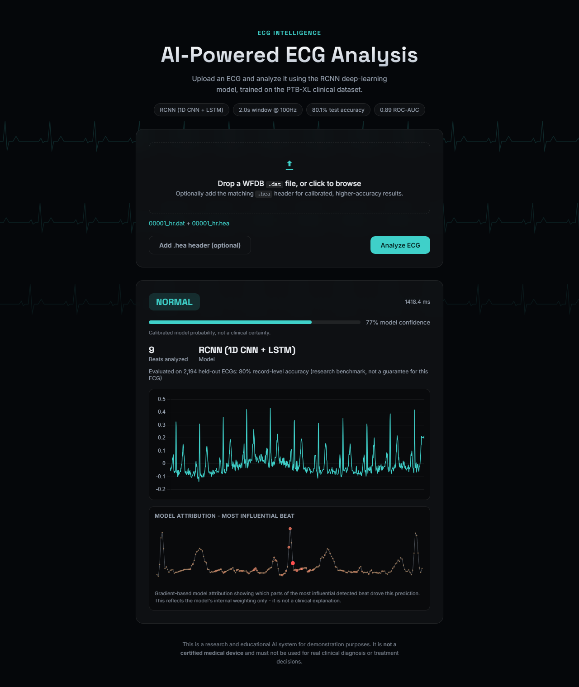

# ECG Abnormality Detection using CNN-LSTM

AI-powered ECG classification: an RCNN (1D CNN + LSTM), trained on the [PTB-XL](https://physionet.org/content/ptb-xl/1.0.3/) clinical ECG dataset, served through a FastAPI REST API and a static web frontend. Given an uploaded WFDB ECG signal, it returns a calibrated normal/abnormal prediction, confidence, beat count, waveform, and a gradient-based explanation of the prediction.

> **Not a medical device.** This is a research and portfolio engineering project. It has not been clinically validated and must never be used for real diagnosis or treatment decisions. See [Limitations](#limitations).

## Demo

- **Frontend (Vercel):** [https://ecg-detection-two.vercel.app](https://ecg-detection-two.vercel.app) — live, static UI.
- **Backend (Render):** not yet deployed. The frontend and backend are intentionally separate services (see [Architecture](#architecture)); until the backend is deployed and `ECG_API_URL` is set on Vercel, the live frontend loads correctly but cannot return a real prediction. See [Deployment](#deployment) for the exact remaining steps.



*Real output from a local run: uploading the bundled sample WFDB record through the actual UI, end to end.*

## Features

- ECG upload (WFDB `.dat` + optional `.hea` header) via a drag-and-drop web UI
- Shared preprocessing pipeline: signal calibration, resampling, R-peak detection, beat windowing
- CNN-LSTM (RCNN) inference for normal/abnormal classification
- Record-level prediction (beat probabilities aggregated into one result per upload)
- Calibrated probability (temperature scaling, not a raw model output)
- Waveform visualization (Chart.js)
- Gradient-based explainability (model attribution on the most-confident beat)
- FastAPI REST API (`/health`, `/model-info`, `/predict`)
- Interactive API documentation (`/docs`, `/redoc`, `/openapi.json`)
- Secure upload handling (filename sanitization, size limits, sandboxed temp directories, guaranteed cleanup)

## Architecture

```
User (browser)
    |
    v
Vercel - static frontend (public/, api/config.js)
    |  fetch(`${ECG_API_URL}/predict`)  -- cross-origin, CORS-gated
    v
Render - FastAPI backend (uvicorn app.main:app)
    |
    v
Preprocessing (ecg/preprocessing.py) -- load, resample, R-peak detect, window
    |
    v
CNN-LSTM / RCNN inference (ecg/model.py, TensorFlow/Keras)
    |
    v
Aggregation + calibration (ecg/postprocessing.py)
    |
    v
Prediction JSON -> back to the browser
```

**Why two separate services:** TensorFlow's installed footprint (~1.4GB) exceeds Vercel's Python serverless function size limit (~250MB) - measured directly, not assumed, after an earlier attempt to deploy the whole stack as one Vercel function never went live. Vercel therefore serves only the static frontend and one dependency-free Node function (`api/config.js`) that hands the frontend the backend's URL at request time; the actual TensorFlow inference runs on Render, a conventional Python host with no such size ceiling.

## Machine Learning

- **Dataset:** [PTB-XL](https://physionet.org/content/ptb-xl/1.0.3/) - 21,799 clinical 12-lead ECGs from 18,869 patients, each annotated with SCP-ECG diagnostic codes.
- **Preprocessing** (`ecg/preprocessing.py`, one implementation shared by training and live inference):
  1. Load the signal via WFDB in calibrated millivolts (`physical=True`).
  2. Resample to a fixed 100Hz so a fixed-length window always spans the same physical duration.
  3. Detect R-peaks with an amplitude threshold and a physiologically-derived minimum RR interval.
  4. Extract a 200-sample (2s) window centered on each R-peak.
  5. Z-score normalize each window (zero mean, unit variance).
- **Model** (`ecg/model.py: build_rcnn`) - a 1D CNN feature extractor feeding a 2-layer LSTM:
  ```
  Conv1D(64, k=5) -> MaxPool -> BatchNorm
  Conv1D(128, k=5) -> MaxPool -> BatchNorm
  Conv1D(256, k=5) -> MaxPool
  LSTM(256, return_sequences=True)
  LSTM(128)
  Dense(256, relu) -> Dropout(0.4)
  Dense(1, sigmoid)
  ```
  The Conv1D layers learn local beat morphology; the LSTM layers model how that morphology evolves over the window. A CNN-only baseline (same conv stack, no LSTM) is trained alongside it for comparison - see [Results](#results).
- **Record-level aggregation** (`ecg/postprocessing.py`) - a user uploads a whole record, not one beat, so all of a record's beat probabilities are mean-pooled into a single probability (5 pooling methods were compared on validation; mean-pooling won and was kept deliberately - the best alternative beat it by only 0.14pp F1).
- **Probability calibration** - a single temperature parameter (fit on the validation fold only, T≈1.16) rescales the aggregated probability so it's closer to empirical accuracy. It's a monotonic transform - it never changes which class is predicted.

Full methodology, including the patient-safe fold split and a labeling bug that was found and fixed during development, is documented in [`MODEL_CARD.md`](MODEL_CARD.md).

## Results

Scored once against the untouched test fold (fold 10: 2,194 records / 22,212 beats):

| Granularity | Model | Accuracy | Macro F1 | ROC-AUC | Specificity |
|---|---|---|---|---|---|
| Beat-level | RCNN | 79.4% | 0.790 | 0.883 | 0.859 |
| Record-level | RCNN | 80.1% | 0.800 | 0.889 | 0.886 |
| Record-level | CNN (baseline) | 80.4% | 0.803 | 0.890 | 0.882 |

**Record-level is what `/predict` actually returns.** The CNN baseline nominally edges ahead of the RCNN at that granularity - this is disclosed rather than hidden; mean-pooling many beats per record smooths out most of the per-beat variance the LSTM helps with individually. RCNN is kept as the primary model per project scope. Full confusion matrices, per-class metrics, and the multi-label proof-of-concept results are in [`MODEL_CARD.md`](MODEL_CARD.md) and `artifacts/reports/` (regenerate with `python scripts/evaluate_model.py`).

## Dataset Setup

The full PTB-XL dataset (several GB) is **not** included in this repository and must never be committed to it.

1. Go to the official PhysioNet page: [physionet.org/content/ptb-xl/1.0.3](https://physionet.org/content/ptb-xl/1.0.3/). PTB-XL is listed there as an **Open Access** database under the **Creative Commons Attribution 4.0 International** license - no PhysioNet credentialing/training is required (unlike restricted datasets such as MIMIC-III), only agreement to that license's terms.
2. Download the files - either the "Download the files" button on that page, or from a terminal:
   ```bash
   wget -r -N -c -np https://physionet.org/files/ptb-xl/1.0.3/
   ```
3. Extract/place it locally, then set `ECG_DATASET_ROOT` (in your `.env`, copied from `.env.example`) to the folder that directly contains the files below.
4. Expected directory structure:
   ```
   <ECG_DATASET_ROOT>/
     ptbxl_database.csv
     scp_statements.csv
     records100/...
     records500/...
   ```
5. This directory must stay outside the repository - `.gitignore` already excludes `data/ptbxl/`, and nothing in the served application reads this path at runtime (only the offline scripts below do).
6. Cite the dataset per PhysioNet's citation guidance on the page above if you publish anything using it.

## Local Installation

```bash
git clone https://github.com/mubarak6969/ECG_DETECTION.git
cd ECG_DETECTION

python -m venv .venv

# Windows
.venv\Scripts\activate

# Linux/macOS
source .venv/bin/activate

pip install -r requirements-dev.txt
cp .env.example .env
# edit .env: set ECG_DATASET_ROOT (only needed for training/data-prep scripts)
```

Every environment variable is documented with its default and purpose in [`.env.example`](.env.example) - `ecg/config.py` reads each one, falling back to a sane default if it's unset.

## Running the API

```bash
uvicorn app.main:app --host 0.0.0.0 --port 8000
```

| Endpoint | Method | Purpose |
|---|---|---|
| `/health` | GET | Liveness/readiness probe - `{"status": "ok", "model_loaded": true, "model_type": "rcnn"}` |
| `/model-info` | GET | Architecture and last-evaluated record-level test metrics |
| `/predict` | POST | Multipart upload (`file` required `.dat`, `hea_file` optional `.hea`) - returns prediction, confidence, beats analyzed, waveform, explainability |
| `/docs` | GET | Interactive Swagger UI |
| `/redoc` | GET | ReDoc API documentation |
| `/openapi.json` | GET | Raw OpenAPI schema |

## Model Artifact

The trained model (`rcnn_model.h5`, ~11.6MB) is **never committed to Git**. At startup, the FastAPI app's lifespan (`app/model_state.py`, via `ecg/model_bootstrap.py: ensure_model_present`) downloads it from the `ECG_MODEL_URL` environment variable if it isn't already present on disk, then loads it into memory once. For local development, running the training pipeline below produces it directly at `artifacts/models/rcnn_model.h5` (gitignored); for deployment, host your own trained copy somewhere with a stable direct-download link (e.g. a GitHub Release asset on your fork) and point `ECG_MODEL_URL` at it.

```bash
python scripts/prepare_data.py       # builds artifacts/splits/*.npy from PTB-XL
python scripts/train_model.py        # trains cnn_model.h5 + rcnn_model.h5
python scripts/evaluate_model.py     # writes artifacts/reports/evaluation_report.json
```

## Testing

```bash
python -m pytest
```

**67/67 tests passing** - config invariants, patient-leakage-free dataset splitting, preprocessing edge cases, aggregation/calibration correctness (including a regression test locking in a real confidence-calculation bug fix), explainability verified against a closed-form gradient, and the FastAPI backend (validation, CORS, cleanup, `/docs`+`/redoc`+`/openapi.json` availability, and a real end-to-end prediction against the bundled demo record). CI (`.github/workflows/ci.yml`) runs lint + the full suite on every push.

## Project Structure

```
ecg/            shared ML package - preprocessing, dataset, model, postprocessing, explainability
app/            FastAPI backend - main.py, model_state.py, uploads.py, routes/, schemas/
public/         static frontend (Vercel) - HTML/CSS/JS, Chart.js
api/config.js   one Vercel Node function - hands the frontend ECG_API_URL
scripts/        offline pipeline - prepare_data, train_model, evaluate_model, etc.
tests/          67 passing pytest tests
data/demo/      one bundled sample WFDB record used by tests and demos
artifacts/      generated, gitignored - trained models, splits, reports
Dockerfile      production container build
MODEL_CARD.md   full model card - architecture, methodology, metrics, limitations
```

## Security

- Filenames are sanitized (`app/uploads.py: secure_filename`) and written into a per-request random (`uuid4`) subdirectory - closes path traversal and cross-request collisions.
- Extension allowlist (`.dat` required, `.hea` optional) and a dual-layer upload size cap (`Content-Length` check + a size-capped streaming read) that also catches a lying or chunked client.
- Every request's temp files are removed in a `finally` block, on every code path including errors.
- A global exception handler ensures no raw traceback or filesystem path is ever returned to the client - failures are logged server-side and answered with a generic, safe message.
- CORS is an exact-origin allowlist (`ECG_FRONTEND_ORIGIN`), never `*` - unset means no cross-origin request is allowed at all.
- Secrets/config are environment-based; `.env` is gitignored and never committed.

## Limitations

- **Not a clinical diagnostic system.** No clinical validation has been performed; predictions must never inform a real diagnosis or treatment decision.
- **No external validation.** All metrics come from PTB-XL's own held-out test fold; performance on a different population, device, or acquisition protocol is unverified.
- **Record-level labels applied per-beat introduce label noise** - PTB-XL's diagnosis is one label per record, but training happens on individual beat windows.
- **Calibration is Brier-score-verified only**, not checked against a real clinical-agreement study - a calibrated probability is a research-grade estimate, not a validated real-world likelihood.
- **The multi-label diagnostic pipeline (`ecg/multilabel.py`) is a small proof-of-concept**, not a production model, and is not wired into the live application.
- **R-peak detection is a fixed-threshold `find_peaks` call**, not a dedicated QRS detector - noisy or low-amplitude leads can under/over-detect beats.
- **Training is CPU-capped** at a stratified subset of the full training fold for tractability, documented in `MODEL_CARD.md`.
- **Deployment is incomplete** - see [Demo](#demo) and [Deployment](#deployment).

## Future Work

1. Train on the full training fold on a GPU instead of the current CPU-capped subset.
2. Finish connecting the Render backend to the live Vercel frontend (`ECG_API_URL`/`ECG_MODEL_URL`/`ECG_FRONTEND_ORIGIN`).
3. Replace the fixed-threshold peak detector with a dedicated QRS detector (e.g. Pan-Tompkins).
4. Scale the multi-label pipeline past proof-of-concept with the full training fold and class weighting.
5. Add model versioning and a canary evaluation step to CI.

## Deployment

**Render** (backend) - build command, start command, and required environment variables:

```
Build:  pip install -r requirements.txt
Start:  uvicorn app.main:app --host 0.0.0.0 --port $PORT
```

| Variable | Value |
|---|---|
| `ECG_MODEL_URL` | A direct-download URL for your trained `rcnn_model.h5` |
| `ECG_FRONTEND_ORIGIN` | `https://ecg-detection-two.vercel.app` (exact origin, enables CORS for it only) |

**Vercel** (frontend) - one environment variable, read at request time (never hardcoded into source):

| Variable | Value |
|---|---|
| `ECG_API_URL` | The deployed Render backend's URL, once it exists |

See [Local Installation](#local-installation) and [Running the API](#running-the-api) above for how to run and verify the backend before deploying it.
